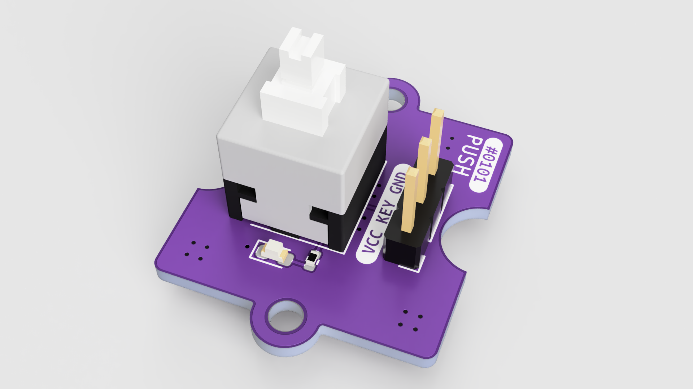

0101-PUSH
==========

一个简易的 8.5mm 开关，附带 LED 指示灯。

## 特性

1. 预留了上拉/下拉、高电平有效/低电平有效的配置电阻
2. 预留消抖电容
3. 附带 LED 指示灯

## 配置

| 电阻 | R1 | R2 |
| ---- | -- | -- |
| 上拉 | ✓ | × |
| 下拉 | × | ✓ |

| 电阻 | R3 | R4 |
| ---- | -- | -- |
| 高电平有效 | ✓ | × |
| 低电平有效 | × | ✓ |

## 协议

[CERN-OHL-P-2.0](LICENSE)
